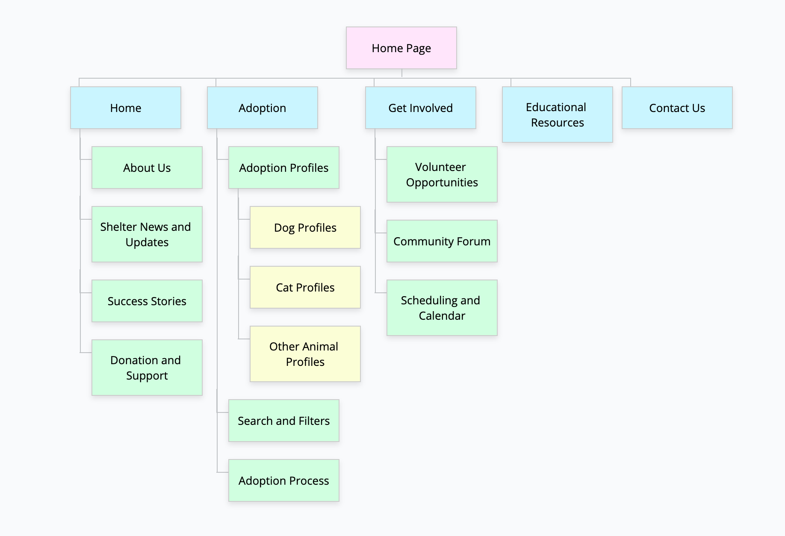

# Class 2 Project

# User personas and information architecture

## User personas for animal rescue shelter web application

1. **Animal Lover Advocate - Nora**
    - **Background**: Nora is a 30-year-old marketing professional who has a deep love for animals. She volunteers at the local animal rescue shelter and frequently fosters animals in need.
    - **Goals**: Nora wants to stay updated on the shelter's latest rescues, events, and volunteer opportunities. She is keen to promote the shelter's mission through her social media channels.
    - **Needs**:
        - Access to the shelter's pet profiles, including photos and descriptions.
        - Notifications about new arrivals and upcoming adoption events.
        - Easy sharing features for social media to help animals find forever homes.
        - Volunteer scheduling and sign-up options.
2. **Prospective Pet Owner - Michael**
    - **Background**: Michael is a 40-year-old single professional who is considering adopting a pet for companionship. He is looking for a dog to share his active lifestyle.
    - **Goals**: Michael wants to find the perfect pet that matches his lifestyle and preferences. He needs information on available animals, their health, and adoption process.
    - **Needs**:
        - Search filters for animal type, breed, age, and temperament.
        - Detailed profiles on animals, including their history and health status.
        - Adoption application submission and status tracking.
        - Educational resources on pet care.
3. **Animal Shelter Staff Member - Laura**
    - **Background**: Laura is a 28-year-old shelter manager with a passion for animal welfare. She's responsible for daily operations and ensuring the well-being of animals in the shelter.
    - **Goals**: Laura aims to efficiently manage the shelter's operations, streamline the adoption process, and increase community engagement.
    - **Needs**:
        - A dashboard for managing animal profiles, medical records, and adoption applications.
        - Scheduling and communication tools to coordinate volunteers and staff.
        - Reporting and analytics features to track adoption rates, fundraising, and expenses.
        - Integration with social media for outreach and sharing success stories.

    ## Information architecture and card sorting

    Topics related to an online web application for an animal rescue shelter:

    1. **Adoption Profiles**: Display detailed profiles of animals available for adoption, including photos, descriptions, and medical history.
    2. **Search and Filters**: Implement search and filtering options for users to find animals that match their preferences (e.g., type, breed, age, temperament).
    3. **Adoption Process**: Provide information and step-by-step guides on the adoption process, including application submission and approval.
    4. **Volunteer Opportunities**: List volunteer opportunities and allow users to sign up, track their shifts, and manage their volunteer activities.
    5. **Events and Fundraising**: Promote upcoming events, fundraisers, and donation campaigns to engage the community and gather support.
    6. **Success Stories**: Share stories of animals that found forever homes, showcasing the impact of the shelter's work.
    7. **Educational Resources**: Offer articles, videos, and guides on pet care, training, and responsible ownership.
    8. **Animal Health**: Provide information on animal health and well-being, as well as updates on the medical status of animals in the shelter.
    9. **Animal Welfare**: Explain the shelter's mission and commitment to animal welfare, reinforcing the values it upholds.
    10. **Donation and Support**: Create a platform for users to make monetary donations, offer in-kind support, or sponsor an animal.
    11. **Community Forum**: Establish a community forum for animal lovers, adopters, and volunteers to share experiences, ask questions, and provide advice.
    12. **Integration with Social Media**: Connect the web application with social media platforms for easy sharing of animal profiles and success stories.
    13. **Shelter News and Updates**: Share regular updates on shelter news, new arrivals, and upcoming initiatives to keep users informed.
    14. **Scheduling and Calendar**: Maintain a volunteer and staff scheduling system, with calendar features to manage shifts and events.
    15. **Feedback and Contact**: Allow users to provide feedback, contact the shelter, or report issues with the application to ensure continuous improvement.

    ---

    ### Card Sorting

    **Nora:**

    **Category: Animal Profiles and Promotion**

    1. Adoption Profiles
    2. Success Stories
    3. Integration with Social Media

    **Category: Volunteer and Foster Engagement**

    1. Volunteer Opportunities
    2. Community Forum

    **Category: Animal Welfare Information**

    1. Animal Health
    2. Animal Welfare

    **Category: Fundraising and Support**

    1. Events and Fundraising
    2. Donation and Support

    **Category: Shelter News and Updates**

    1. Shelter News and Updates

    **Category: Educational Resources**

    1. Educational Resources

    **Category: Direct Communication**

    1. Feedback and Contact

    For someone like Nora, who is deeply involved with the shelter and is actively engaged in animal welfare efforts, the categorisation allows her to focus on animal profiles, promoting the shelter's mission, and staying informed about the welfare and needs of the animals. It also ensures she has easy access to resources and a channel for direct communication with the shelter staff.

    ---

    **Michael:**

    **Category: Finding the Perfect Pet**

    1. Adoption Profiles
    2. Search and Filters

    **Category: Adoption Guidance**

    1. Adoption Process
    2. Educational Resources

    **Category: Engagement with the Shelter**

    1. Volunteer Opportunities
    2. Shelter News and Updates
    3. Feedback and Contact

    **Category: Supporting the Shelter**

    1. Donation and Support
    2. Community Forum

    **Category: Connecting with the Community**

    1. Community Forum
    2. Integration with Social Media

    **Category: Event Information**

    1. Events and Fundraising

    For someone like Michael, who is actively considering adopting a dog to match his active lifestyle, the categorisation focuses on helping him find the perfect pet, guiding him through the adoption process, providing information about the shelter's events and community engagement opportunities, and offering resources for responsible pet ownership. This structure ensures he can efficiently access the information and support he needs during the adoption process.

    ---

    **Laura:**

    **Category: Animal Management**

    1. Adoption Profiles
    2. Animal Health
    3. Animal Welfare

    **Category: Volunteer and Staff Coordination**

    1. Volunteer Opportunities
    2. Scheduling and Calendar
    3. Community Forum

    **Category: Shelter Operations and Updates**

    1. Shelter News and Updates
    2. Feedback and Contact

    **Category: Fundraising and Support**

    1. Donation and Support
    2. Events and Fundraising

    **Category: Educational Resources**

    1. Educational Resources

    **Category: Promotion and Engagement**

    1. Success Stories
    2. Integration with Social Media

    For someone like Laura, who is responsible for the shelter's daily operations and animal welfare, this categorisation ensures efficient animal management, coordination of volunteers and staff, and access to resources for shelter operations. It also provides avenues for fundraising, community engagement, and promotion of success stories, all of which are vital to her role as a shelter manager.

    ---

    **Combined result:**

    **Category: Finding the Perfect Pet**

    1. Adoption Profiles
    2. Search and Filters

    **Category: Adoption Guidance**

    1. Adoption Process
    2. Educational Resources

    **Category: Engagement with the Shelter**

    1. Volunteer Opportunities
    2. Community Forum
    3. Scheduling and Calendar
    4. Feedback and Contact

    **Category: Animal Welfare and Health**

    1. Animal Health
    2. Animal Welfare

    **Category: Supporting the Shelter**

    1. Donation and Support
    2. Events and Fundraising

    **Category: Shelter Operations and Updates**

    1. Shelter News and Updates

    **Category: Promotion and Engagement**

    1. Success Stories
    2. Integration with Social Media

    This comprehensive categorisation addresses the diverse needs of Nora, Michael, and Laura, providing a well-organised structure for the web application that serves potential adopters, volunteers, shelter managers, and animal advocates alike.

## Create a sitemap

